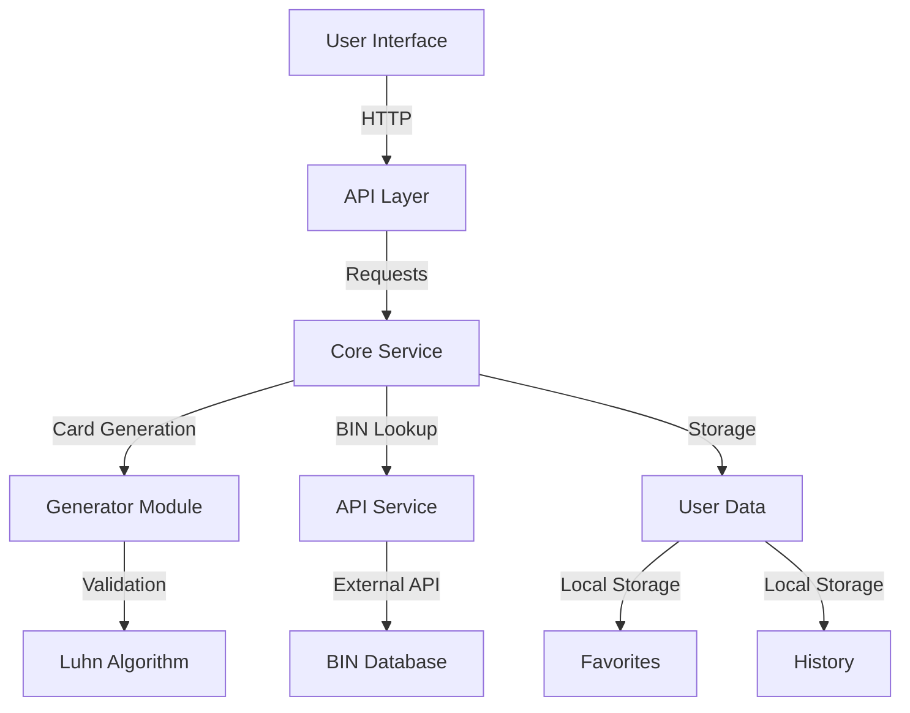
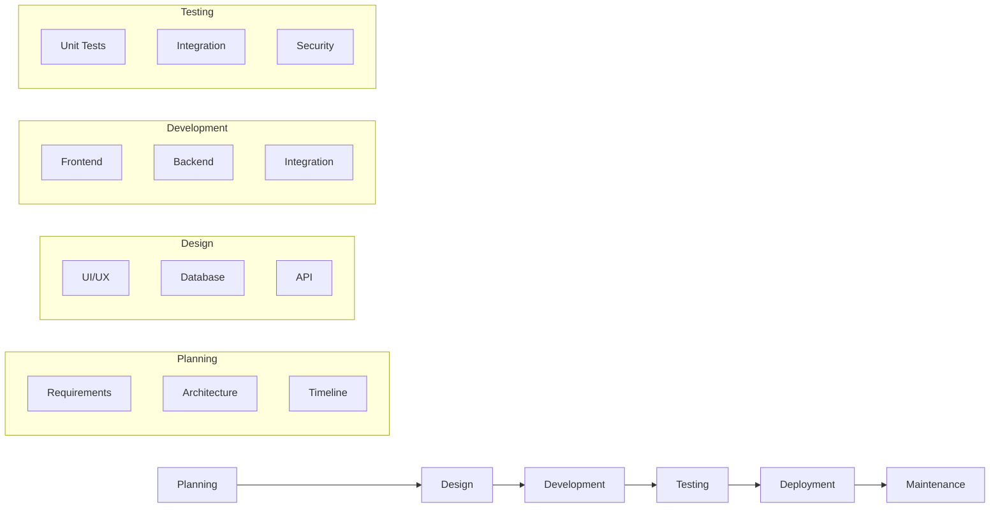

# 🚀 CardGen Pro

A sophisticated card number generator and BIN lookup tool built with Node.js and Telegram Bot API. Designed for educational and testing purposes, helping developers and QA teams simulate card inputs to validate forms, payment systems, or backend processing without using real data.

## 🌟 Features

### Card Generation
- **Multiple Formats**: PIPE, CSV, JSON, XML, SQL
- **Customizable Parameters**: BIN, Month, Year, CVV
- **Bulk Generation**: Generate up to 100 cards at once
- **Luhn Algorithm**: Valid card number generation
- **Favorites System**: Save and manage frequently used BINs

### BIN Lookup
- **Detailed Information**: Bank, brand, country, type, level
- **Multiple APIs**: Fallback support for reliable data
- **History Tracking**: Keep track of your lookups
- **Offline Cache**: Store results for faster access

### User Experience
- **Bilingual Support**: English and Spanish
- **Responsive Design**: Works on all devices
- **Dark Mode**: Eye-friendly interface
- **Real-time Validation**: Instant feedback
- **Export Options**: Multiple file formats

## 🏗 System Architecture



## 🛠 Tech Stack

- **Frontend**: HTML5, CSS3, JavaScript (ES6+)
- **Backend**: Node.js, Express
- **Database**: Local Storage
- **APIs**: BIN Lookup, Telegram Bot API
- **Tools**: Vite, ESLint, Prettier

## 📦 Installation

1. Clone the repository:
```bash
git clone https://github.com/mat1520/Credit-Cart-Gen-Luhn.git
cd Credit-Cart-Gen-Luhn
```

2. Install dependencies:
```bash
npm install
```

3. Start the development server:
```bash
npm run dev
```

## 🔧 Configuration

Create a `.env` file in the root directory:
```env
BOT_TOKEN=your_telegram_bot_token
API_KEY=your_bin_lookup_api_key
```

## 📚 Usage

### Web Interface
1. Open `index.html` in your browser
2. Enter BIN number (6-16 digits)
3. Select format and parameters
4. Click "Generate" to create cards

### Telegram Bot
1. Start the bot: `/start`
2. Generate cards: `/gen BIN|MM|YYYY|CVV`
3. Lookup BIN: `/bin BIN`
4. Manage favorites: `/favorites`

## 🔍 Development Process



## 🛡️ Security Features

- Rate limiting
- Input validation
- Error handling
- Secure storage
- API key protection

## 📈 Performance Optimization

- Lazy loading
- Caching
- Code splitting
- Minification
- Compression

## 🤝 Contributing

1. Fork the repository
2. Create your feature branch (`git checkout -b feature/AmazingFeature`)
3. Commit your changes (`git commit -m 'Add some AmazingFeature'`)
4. Push to the branch (`git push origin feature/AmazingFeature`)
5. Open a Pull Request

## 📄 License

This project is licensed under the MIT License - see the [LICENSE](LICENSE) file for details.

## 📞 Contact

- Telegram: [@CardGenPro_BOT](https://t.me/CardGenPro_BOT?start=_tgr_y1X3A7NlZDAx)
- GitHub: [@mat1520](https://github.com/mat1520)

---

Built with ❤️ by MAT1520 