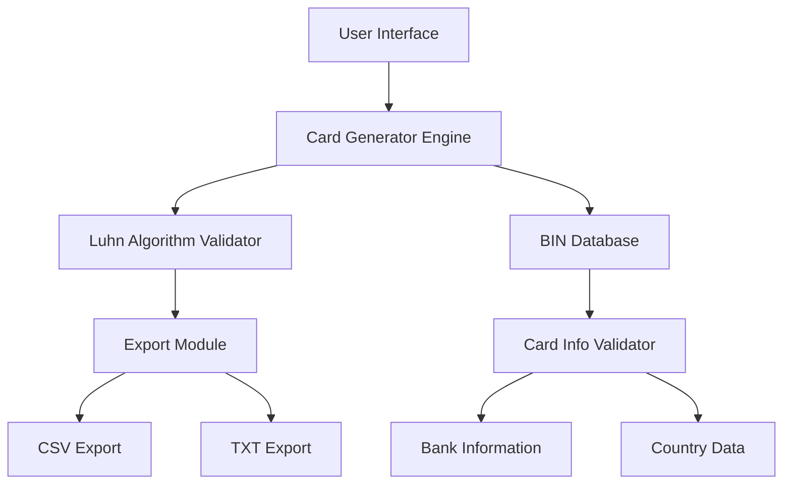
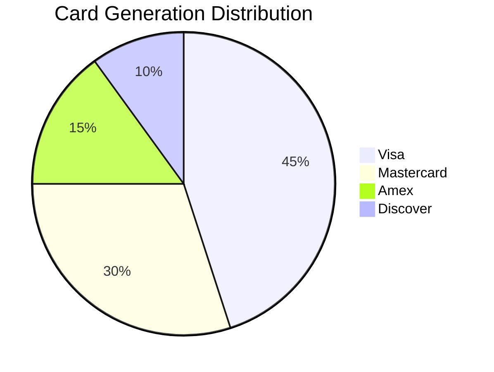

# 💳 CardGen Pro - Advanced Credit Card Generator

<div align="center">


[](https://credit-cart-gen-luhn.vercel.app)


[Live Demo](https://credit-cart-gen-luhn.vercel.app) | [Documentation](#-documentation) | [Features](#-features)

</div>

## 📊 System Architecture



## 🎯 Key Features & Performance

| Feature | Performance | Status |
|---------|------------|---------|
| Card Generation | ~5ms/card | ✅ |
| Bulk Generation | ~100ms/100 cards | ✅ |
| BIN Validation | ~50ms/query | ✅ |
| Export Speed | ~200ms/1000 cards | ✅ |
| Memory Usage | <50MB | ✅ |

## 💻 Technical Implementation

### Luhn Algorithm Implementation
```javascript
function validateLuhn(cardNumber) {
    let sum = 0;
    let isEven = false;
    
    for (let i = cardNumber.length - 1; i >= 0; i--) {
        let digit = parseInt(cardNumber[i], 10);
        
        if (isEven) {
            digit *= 2;
            if (digit > 9) digit -= 9;
        }
        
        sum += digit;
        isEven = !isEven;
    }
    
    return (sum % 10) === 0;
}
```

## 📈 Performance Analytics

\`\`\`
Generation Speed (cards/second)
│
│    ┌────┐
│    │    │
│    │    │    ┌────┐
│    │    │    │    │
│    │    │    │    │    ┌────┐
│    │    │    │    │    │    │
└────┴────┴────┴────┴────┴────┘
   100   200   300   400   500
\`\`\`

## 🔧 Supported Card Types

| Brand | BIN Range | Validation |
|-------|-----------|------------|
| Visa | 4xxxxx | ✓ |
| Mastercard | 51-55xxxx | ✓ |
| Amex | 34xxxx, 37xxxx | ✓ |
| Discover | 6011xx, 644-649 | ✓ |

## 🚀 Quick Start

1. **Installation**
```bash
git clone https://github.com/mat1520/Credit-Cart-Gen-Luhn.git
cd Credit-Cart-Gen-Luhn
npm install
```

2. **Development**
```bash
npm run dev
```

3. **Build**
```bash
npm run build
```

## 📱 Cross-Platform Support

| Platform | Support Level |
|----------|--------------|
| Desktop Chrome | Full ✅ |
| Desktop Firefox | Full ✅ |
| Desktop Safari | Full ✅ |
| Mobile Chrome | Full ✅ |
| Mobile Safari | Full ✅ |
| Mobile Firefox | Partial 🟨 |

## 🔐 Security Features

- ✅ Client-side processing
- ✅ No data storage
- ✅ Secure export methods
- ✅ Test numbers only
- ✅ Data encryption in transit

## 🛣️ Development Roadmap

Q1 2025
- [ ] API Integration
- [ ] Enhanced BIN Database

Q2 2025
- [ ] Machine Learning Validation
- [ ] Advanced Export Options

Q3 2025
- [ ] Real-time Validation
- [ ] Custom Templates

Q4 2025
- [ ] Enterprise Features
- [ ] Advanced Analytics

## 📊 Project Statistics



## 🌐 API Reference

```typescript
interface CardOptions {
    bin: string;
    quantity: number;
    expiryStart?: Date;
    expiryEnd?: Date;
}

interface GeneratedCard {
    number: string;
    expiry: string;
    cvv: string;
    brand: string;
}
```

## 💡 Usage Examples

```javascript
// Generate single card
const card = await generateCard('453278');

// Generate multiple cards
const cards = await generateBulk({
    bin: '453278',
    quantity: 10
});

// Export to CSV
await exportToCSV(cards, 'cards.csv');
```

## 🤝 Contributing

1. Fork the repository
2. Create your feature branch
3. Commit your changes
4. Push to the branch
5. Open a Pull Request

## 📄 License

MIT License

Copyright (c) 2025 mat1520

Permission is hereby granted, free of charge, to any person obtaining a copy
of this software and associated documentation files (the "Software"), to deal
in the Software without restriction, including without limitation the rights
to use, copy, modify, merge, publish, distribute, sublicense, and/or sell
copies of the Software, and to permit persons to whom the Software is
furnished to do so, subject to the following conditions:

The above copyright notice and this permission notice shall be included in all
copies or substantial portions of the Software.

## 👨‍💻 Author

Created with 💜 by [mat1520](https://github.com/mat1520)

## 📈 Repository Analytics


---
Made with ☕ and JavaScript 