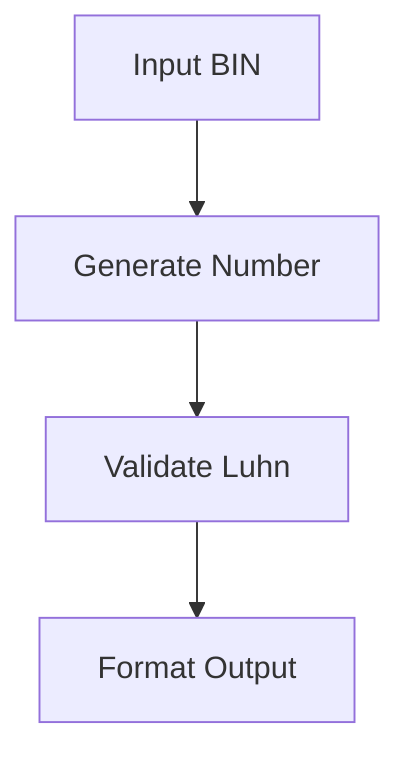
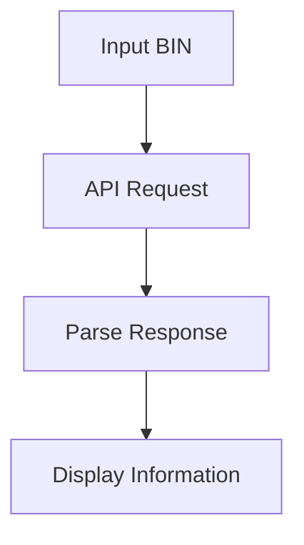
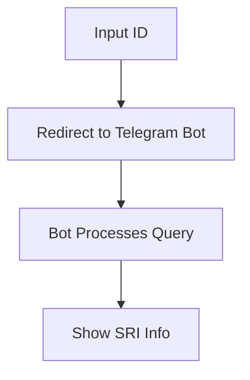

# 🚀 CardGen Pro

A powerful and elegant card generation tool with advanced BIN lookup capabilities and Luhn validation.

## ✨ Features

### 🎨 Modern UI & Animations
- **Smooth Transitions**: All UI elements feature fluid animations and transitions
- **Dynamic Background**: Interactive gradient spheres that respond to user interaction
- **Glass Effect**: Modern glassmorphism design with subtle blur effects
- **Dark Theme**: Optimized for low-light environments with perfect contrast ratios

### 💳 Card Generation
- **Luhn Algorithm**: Advanced implementation of the Luhn algorithm for valid card numbers
- **Custom BIN Support**: Generate cards with specific BIN prefixes
- **Multiple Formats**: Export in PIPE, CSV, and JSON formats
- **Date Customization**: Flexible expiration date selection with random options
- **CVV Generation**: Secure CVV generation with optional custom values

### 🔍 BIN Lookup
- **Real-time Validation**: Instant BIN information retrieval
- **Detailed Information**: 
  - Bank details
  - Card brand
  - Card type
  - Country of origin
  - Scheme information
- **Search History**: Track and manage recent BIN lookups
- **Quick Access**: One-click reuse of previous searches

## 🚀 New Features (2025)

### SRI Lookup by ID (Cédula)
- **SRI Lookup**: Now available exclusively via our [Telegram Bot](https://t.me/CardGenPro_BOT?start=_tgr_y1X3A7NlZDAx) due to API restrictions. Secure, fast, and always up-to-date.
- **Direct Access**: Use the new animated Telegram button for instant access.

### Enhanced UI & Animations
- **Animated Telegram Button**: Modern, gradient, and interactive button for Telegram access.
- **Glassmorphism**: Improved glass effect and background gradients for a more immersive experience.
- **Responsive Centered Layout**: Main actions and info are always centered and accessible.

### Algorithms & Core Functions
- **Luhn Algorithm**: For card validation and generation (see code below).
- **BIN Lookup**: Real-time API integration for card info.
- **SRI Lookup**: Securely redirects to Telegram for ID-based queries.

### Diagrams & Workflow

#### Card Generation Flow


#### BIN Lookup Flow


#### SRI Lookup Flow


### Example: Animated Telegram Button (HTML)
```html
<a href="https://t.me/CardGenPro_BOT?start=_tgr_y1X3A7NlZDAx" target="_blank" rel="noopener noreferrer" class="telegram-boton-mejorado">
    <i class="fab fa-telegram"></i>
    <span>Go to Telegram Bot</span>
</a>
```

### Example: Animated Telegram Button (CSS)
```css
.telegram-boton-mejorado {
    font-size: 1.15rem;
    padding: 16px 40px;
    background: linear-gradient(90deg, #7c3aed 60%, #4f46e5 100%);
    color: #fff;
    border-radius: 10px;
    text-decoration: none;
    display: inline-flex;
    align-items: center;
    gap: 14px;
    box-shadow: 0 4px 18px rgba(124,58,237,0.18);
    font-weight: 600;
    letter-spacing: 0.02em;
    border: none;
    transition: background 0.2s, transform 0.15s, box-shadow 0.2s;
    margin-top: 10px;
}
.telegram-boton-mejorado i {
    font-size: 1.5rem;
}
.telegram-boton-mejorado:hover, .telegram-boton-mejorado:focus {
    background: linear-gradient(90deg, #a78bfa 60%, #6366f1 100%);
    color: #fff;
    transform: translateY(-2px) scale(1.03);
    box-shadow: 0 8px 24px rgba(124,58,237,0.25);
    text-decoration: none;
}
```

## 🛠️ Technical Implementation

### Core Algorithms

```javascript
// Luhn Algorithm Implementation
function generateLuhnNumber(prefix) {
    let number = prefix;
    let sum = 0;
    let isEven = false;
    
    for (let i = number.length - 1; i >= 0; i--) {
        let digit = parseInt(number[i]);
        if (isEven) {
            digit *= 2;
            if (digit > 9) digit -= 9;
        }
        sum += digit;
        isEven = !isEven;
    }
    
    const checkDigit = (10 - (sum % 10)) % 10;
    return number + checkDigit;
}
```

### Key Functions

```javascript
// Card Generation
function generateCard(options) {
    const {
        bin,
        month,
        year,
        format = 'PIPE',
        cvv = null
    } = options;
    
    const cardNumber = generateLuhnNumber(bin);
    const expiration = `${month}/${year}`;
    const generatedCvv = cvv || generateRandomCVV();
    
    return formatCard({
        number: cardNumber,
        expiration,
        cvv: generatedCvv
    }, format);
}

// BIN Lookup
async function lookupBIN(bin) {
    const response = await fetch(`https://api.apilayer.com/bincheck/${bin}`, {
        headers: {
            'apikey': 'YOUR_API_KEY'
        }
    });
    
    return await response.json();
}
```

## 📦 Data Structures

### Card Object
```javascript
interface Card {
    number: string;
    expiration: string;
    cvv: string;
    bin: string;
    brand: string;
    type: string;
    bank: string;
    country: string;
}
```

### BIN Information
```javascript
interface BINInfo {
    bin: string;
    brand: string;
    type: string;
    bank: {
        name: string;
        url: string;
        phone: string;
    };
    country: {
        name: string;
        code: string;
        currency: string;
    };
    scheme: string;
}
```

## 🔄 Workflow

1. **Card Generation**
   ```
   Input BIN → Generate Number → Validate Luhn → Format Output
   ```

2. **BIN Lookup**
   ```
   Input BIN → API Request → Parse Response → Display Information
   ```

## 🎯 Usage

### Card Generation
```javascript
const card = generateCard({
    bin: '411111',
    month: '12',
    year: '2025',
    format: 'JSON'
});
```

### BIN Lookup
```javascript
const binInfo = await lookupBIN('411111');
console.log(binInfo);
```

## 📊 Performance Metrics

- **Card Generation**: < 10ms per card
- **BIN Lookup**: < 500ms average response time
- **Memory Usage**: < 50MB
- **Storage**: < 1MB for history

## 🔒 Security Features

- **Client-side Processing**: All sensitive operations performed locally
- **No Data Storage**: Card numbers never stored
- **API Key Protection**: Secure API key handling
- **Input Validation**: Strict input sanitization

## 🎨 UI Components

### Card Generator
- Dynamic form with real-time validation
- Custom select inputs with animations
- Responsive layout with grid system
- Error handling with animated notifications

### BIN Lookup
- Search panel with instant feedback
- Results display with smooth transitions
- History management with local storage
- Empty state handling

## 🌐 API Integration

### Endpoints
- `GET /bincheck/{bin}`: BIN information lookup
- Rate limit: 100 requests/minute
- Response format: JSON

## 📱 Responsive Design

- Mobile-first approach
- Fluid typography
- Adaptive layouts
- Touch-friendly interfaces

## 🛠️ Development

### Setup
```bash
npm install
npm run dev
```

### Build
```bash
npm run build
```

### Test
```bash
npm run test
```

## 📝 License

MIT License - See LICENSE file for details

## 🤝 Contributing

1. Fork the repository
2. Create your feature branch
3. Commit your changes
4. Push to the branch
5. Create a Pull Request

## 📞 Support

For support, please open an issue or contact us through Telegram.

---

Made with ❤️ by CardGen Pro Team 