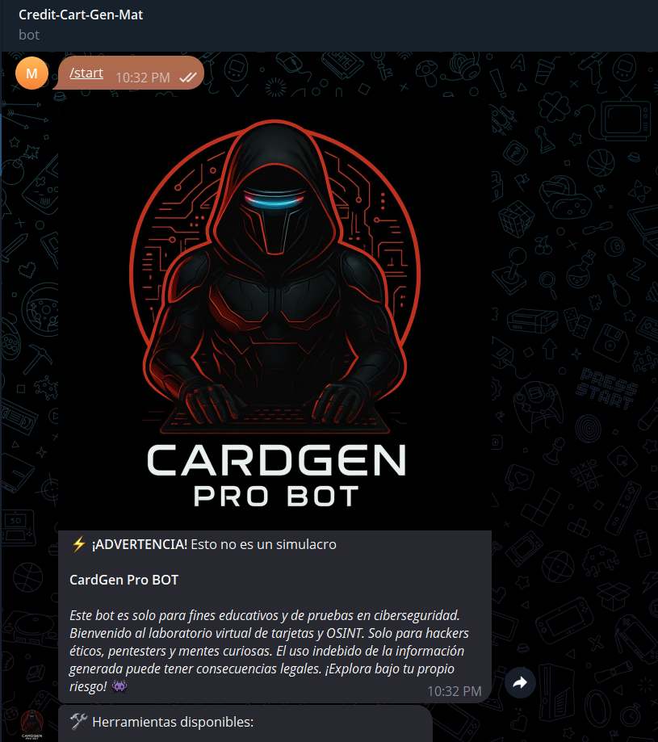

<div align="center">
  
  <h1 style="font-size:2.5rem; color:#7c3aed; margin-bottom:0; text-shadow: 2px 2px 4px rgba(0,0,0,0.1);">CardGen Pro BOT</h1>
  <p style="font-size:1.2rem; color:#444; margin-top:0;">
    <b>🚀 Generador de tarjetas, BIN lookup y OSINT para Web y Telegram</b>
  </p>
  <p>
  <a href="https://t.me/CardGen_Pro_BOT">
      
    </a>
    <a href="https://github.com/mat1520/Credit-Cart-Gen-Luhn">
      
    </a>
    <a href="https://credit-cart-gen-luhn.vercel.app">
      
    </a>
    <a href="https://paypal.me/ArielMelo200?country.x=EC&locale.x=es_XC">
      
    </a>
  </p>
</div>

---

## 🎯 Purpose and Scope

CardGen Pro es un sistema dual (web + bot) para generación de tarjetas, consulta BIN y herramientas OSINT. Implementa el algoritmo Luhn, integra múltiples APIs externas y mantiene persistencia de datos por usuario.

- **🎨 Frontend web multipágina (Vite)**
- **🤖 Bot Telegram (Telegraf)**
- **💾 Persistencia local (localStorage y JSON)**
- **🔗 Integración con APIs externas y fallback**
- **🏗️ Arquitectura robusta y modular**

---

## 🏗️ System Architecture

CardGen Pro emplea una arquitectura de doble interfaz donde tanto el frontend web como el bot de Telegram acceden a servicios core compartidos, pero con persistencia y patrones de interacción diferenciados.

```
┌───────────────────┐         ┌───────────────────┐
│    🌐 Web Frontend │ ◄─────► │   🤖 Telegram Bot  │
│ (Vite, HTML, CSS) │         │ (Node.js, Telegraf)│
└───────────────────┘         └───────────────────┘
         │                             │
         │ 🔗 REST/API calls           │
         ▼                             ▼
┌─────────────────────────────────────────────┐
│            🔌 External APIs                 │
│  (BIN lookup, ipwho.is, mail.tm, SRI, etc.) │
└─────────────────────────────────────────────┘
```

---

## 🗂️ Componentes y Flujo de Datos

- **🌐 Web Frontend:**
  - 📄 Multipágina (Vite): `index.html`, `bin-lookup.html`, `temp-mail.html`, `ip-check.html`, `sri-lookup.html`
  - 💾 Persistencia: `localStorage`
  - ⚙️ Lógica: `src/js/app.js`, `src/js/bin-lookup.js`, etc.

- **🤖 Telegram Bot:**
  - 🎯 Código principal: `telegram-bot/index.js` (Telegraf)
  - 🛠️ Utilidades: `telegram-bot/utils.js`
  - 📁 Persistencia: `data/{userId}.json`
  - ⌨️ Comandos: `/gen`, `/bin`, `/cedula`, `/placa`, `/favoritos`, etc.

- **🔧 Servicios Core:**
  - 🃏 `generateCard()`, `isValidBin()`, `lookupBin()`, `generateTempMail()`, `checkIP()`
  - 🔄 Integración con APIs externas y fallback

- **🔌 APIs Externas:**
  - 🏦 BIN: `binlist.net` (primario), `bintable.com` (fallback)
  - 📧 Email temporal: `mail.tm`
  - 🌍 IP: `ipwho.is`
  - 🇪🇨 SRI Ecuador: `srienlinea.sri.gob.ec`

---

## 🖼️ Capturas de pantalla

<p align="center">
  
  
</p>

---

## ⚡ Instalación rápida

```bash
git clone https://github.com/mat1520/Credit-Cart-Gen-Luhn.git
cd Credit-Cart-Gen-Luhn/telegram-bot
npm install
```

1. 📝 Crea un archivo `.env` en la carpeta `telegram-bot`:
   ```
   BOT_TOKEN=tu_token_de_telegram_aqui
   ```
2. 🚀 Inicia el bot:
   ```bash
   npm start
   ```

> ⚠️ **🔒 Nunca subas tu token a GitHub ni lo compartas públicamente.**

---

## 🌐 Despliegue en la nube

- **🚂 Railway, 🎨 Render, 🦊 Heroku, 🐳 DigitalOcean**  
  Solo necesitas configurar la variable de entorno `BOT_TOKEN` en la plataforma.

---

## 📝 Comandos principales

- 🃏 `/gen BIN|MM|YYYY|CVV` — Genera tarjetas (ej: `/gen 438108|05|25|123`)
- 🏦 `/bin BIN` — Consulta información de un BIN
- 🆔 `/cedula <número>` — Consulta cédula ecuatoriana
- 🚗 `/placa <placa>` — Consulta placa de Ecuador
- ⭐ `/favoritos` — Lista tus BINs favoritos
- 📜 `/historial` — Muestra tu historial
- 🧹 `/clear` — Limpia el chat
- 🏠 `/start` — Menú visual

---

## 🧩 Integración de Componentes y Persistencia

- **🤖 Bot Telegram:**
  - ⌨️ Comandos duales (`/` y `.`)
  - ⏱️ Rate limiting: `isCommandAllowed()`
  - 💾 Persistencia: `loadUserData()`, `saveUserData()` → `data/{userId}.json`
  - 🔄 Fallback de APIs y manejo de errores

- **🌐 Web:**
  - 💾 Persistencia en `localStorage` por herramienta
  - 🔗 Integración directa con APIs desde el navegador

- **🔧 Servicios Core:**
  - 🃏 Luhn: `generateCard()`
  - 🏦 BIN: `lookupBin()` (con fallback)
  - 📧 Email: `generateTempMail()`, `checkTempMail()`
  - 🌍 IP: `checkIP()`
  - 🇪🇨 SRI: consultas a APIs gubernamentales

---

<div align="center" style="margin-top: 2rem;">
  <a href="https://t.me/CardGen_Pro_BOT">
    
  </a>
  <a href="https://github.com/mat1520/Credit-Cart-Gen-Luhn">
    
  </a>
  <a href="https://credit-cart-gen-luhn.vercel.app">
    
  </a>
  <a href="https://paypal.me/ArielMelo200?country.x=EC&locale.x=es_XC">
    
  </a>
</div>

---

<p align="center" style="font-size:1.1rem;">
  👨‍💻 Creado por <b><a href="https://t.me/MAT3810">@MAT3810</a></b> |
  🤖 <a href="https://t.me/CardGen_Pro_BOT">Canal del bot</a> |
  📂 <a href="https://github.com/mat1520/Credit-Cart-Gen-Luhn">GitHub</a> |
  🌐 <a href="https://credit-cart-gen-luhn.vercel.app">Web</a>
</p>
<p align="center" style="font-size:1.1rem;">
  ⭐ Dale una estrella en GitHub &nbsp;|&nbsp; 💬 Únete al canal de Telegram &nbsp;|&nbsp; ☕ <a href="https://paypal.me/ArielMelo200?country.x=EC&locale.x=es_XC">Apóyame en PayPal</a>
</p>

---

> **⚡ Advertencia:** Este bot es solo para fines educativos y de pruebas en ciberseguridad. El uso indebido puede tener consecuencias legales. 🔒 