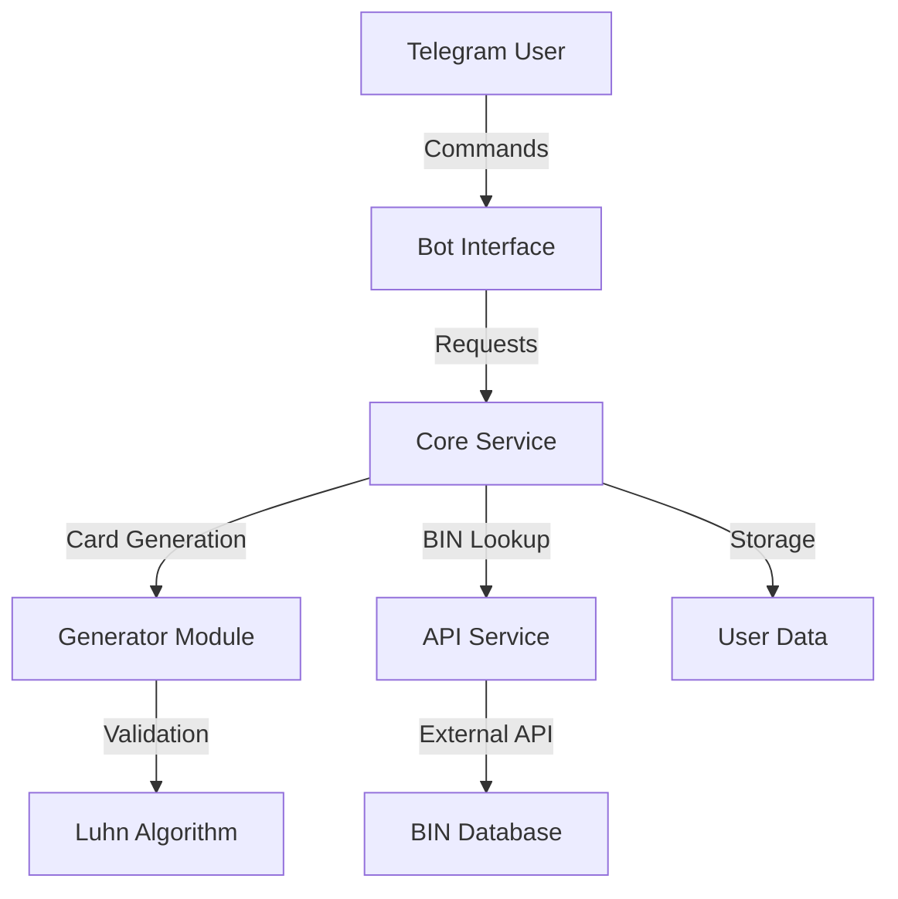

# 🎉 CardGen Pro

<div align="center">
  

  <p align="center">
    <a href="https://credit-cart-gen-luhn.vercel.app">View Demo</a>
    ·
    <a href="https://github.com/yourusername/cardgen-pro/issues">Report Bug</a>
    ·
    <a href="https://github.com/yourusername/cardgen-pro/issues">Request Feature</a>
  </p>

  
  
  
</div>

## 📋 Table of Contents

- [About The Project](#about-the-project)
- [Features](#features)
- [System Architecture](#system-architecture)
- [Getting Started](#getting-started)
- [Usage](#usage)
- [API Documentation](#api-documentation)
- [Contributing](#contributing)
- [License](#license)
- [Contact](#contact)

## 🚀 About The Project

CardGen Pro is an advanced card number generator and BIN lookup tool built with Node.js and Telegram Bot API. It provides a robust platform for generating valid card numbers using the Luhn algorithm and fetching detailed BIN information.

### 🌟 Key Features

- **Card Generation**
  - Supports multiple formats (PIPE, CSV, JSON)
  - Customizable month/year ranges
  - Luhn algorithm validation
  - Bulk generation capability

- **BIN Lookup**
  - Detailed bank information
  - Card scheme identification
  - Geographic data
  - Type and level detection

- **User Management**
  - Favorites system
  - Search history
  - Custom preferences

## 🏗 System Architecture



## 🚦 Getting Started

### Prerequisites

- Node.js >= 14.0.0
- npm >= 6.14.0
- Telegram Bot Token

### Installation

1. Clone the repository
```bash
git clone https://github.com/yourusername/cardgen-pro.git
```

2. Install dependencies
```bash
npm install
```

3. Configure environment variables
```bash
cp .env.example .env
# Edit .env with your settings
```

4. Start the bot
```bash
npm start
```

## 💡 Usage

### Bot Commands

\`\`\`
/start - Welcome message and command list
/gen [BIN|month|year|] - Generate cards
/bin [BIN] - Lookup BIN information
/favorites - View saved BINs
/addbin [BIN] - Add BIN to favorites
/removebin [index] - Remove BIN from favorites
/history - View search history
/help - Show help message
\`\`\`

### Example Usage

1. Generate Cards:
\`\`\`
/gen 438108|05|25|
\`\`\`

2. BIN Lookup:
\`\`\`
/bin 438108
\`\`\`

## 📚 API Documentation

### Card Generation API

\`\`\`typescript
interface CardGenOptions {
  bin: string;
  month?: string;
  year?: string;
  cvv?: string;
  quantity?: number;
}

interface CardResponse {
  number: string;
  month: string;
  year: string;
  cvv: string;
}
\`\`\`

### BIN Lookup API

\`\`\`typescript
interface BinResponse {
  bank: string;
  brand: string;
  country: string;
  type: string;
  level: string;
}
\`\`\`

## 🤝 Contributing

1. Fork the Project
2. Create your Feature Branch (\`git checkout -b feature/AmazingFeature\`)
3. Commit your Changes (\`git commit -m 'Add some AmazingFeature'\`)
4. Push to the Branch (\`git push origin feature/AmazingFeature\`)
5. Open a Pull Request

## 📄 License

```
MIT License

Copyright (c) 2025 CardGen Pro

Permission is hereby granted, free of charge, to any person obtaining a copy
of this software and associated documentation files (the "Software"), to deal
in the Software without restriction, including without limitation the rights
to use, copy, modify, merge, publish, distribute, sublicense, and/or sell
copies of the Software, and to permit persons to whom the Software is
furnished to do so, subject to the following conditions:

The above copyright notice and this permission notice shall be included in all
copies or substantial portions of the Software.

THE SOFTWARE IS PROVIDED "AS IS", WITHOUT WARRANTY OF ANY KIND, EXPRESS OR
IMPLIED, INCLUDING BUT NOT LIMITED TO THE WARRANTIES OF MERCHANTABILITY,
FITNESS FOR A PARTICULAR PURPOSE AND NONINFRINGEMENT. IN NO EVENT SHALL THE
AUTHORS OR COPYRIGHT HOLDERS BE LIABLE FOR ANY CLAIM, DAMAGES OR OTHER
LIABILITY, WHETHER IN AN ACTION OF CONTRACT, TORT OR OTHERWISE, ARISING FROM,
OUT OF OR IN CONNECTION WITH THE SOFTWARE OR THE USE OR OTHER DEALINGS IN THE
SOFTWARE.
```

## 📞 Contact

Owner - [@MAT3810](https://t.me/MAT3810)

Project Link: [https://credit-cart-gen-luhn.vercel.app](https://credit-cart-gen-luhn.vercel.app)

---

<div align="center">
  <sub>Built with ❤️ by <a href="https://t.me/MAT3810">MAT3810</a></sub>
</div> 